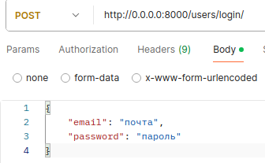
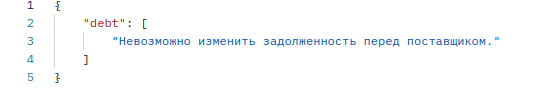
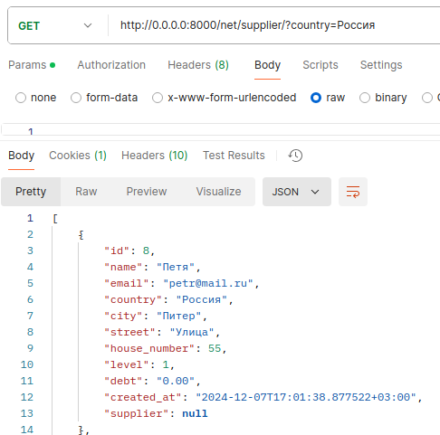
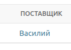
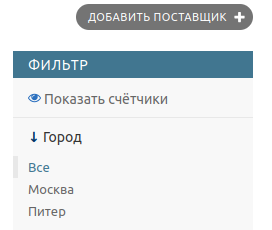
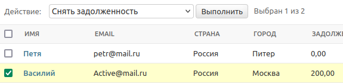

### Приложение для контроля поставщиков и товаров

Для работы с API cоздайте необходимых пользователей командой python3 manage.py csu
. ИЛИ загрузите готовые фикстуры 

- Не авторизованные или неактивные пользователи не имеют доступ к API. После создания пользователя авторизуйтесь

- Нельзя изменить задолженность debt через запрос

- Возможность поиска по стране

#### В админ панели реализовано: 
- у товара есть ссылка на поставщика

- Фильтрация поставщиков по городу

- Кнопка действия снятия задолженности у выбранных поставщиков

